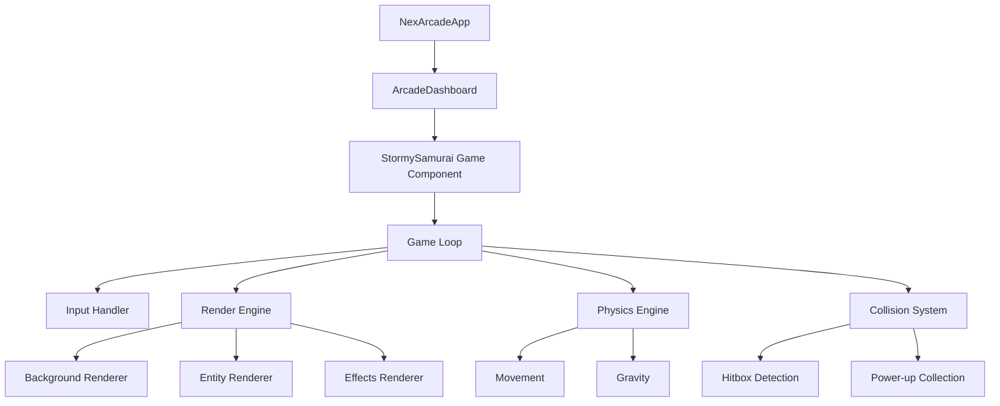
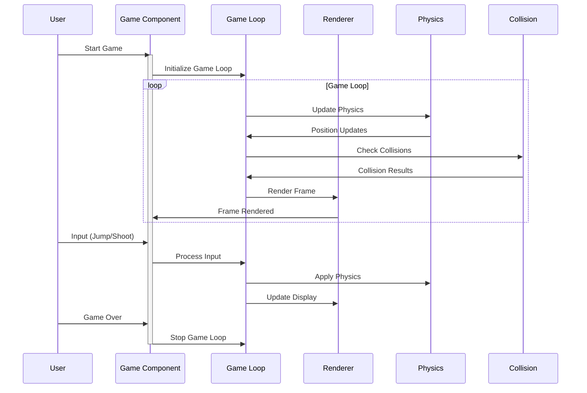

# Stormy Samurai Showdown

A dynamic action game featuring a samurai battling through a stormy environment with various obstacles and power-ups.

## Architecture Overview



## Sequence Diagram



## File Structure

```
src/
├── components/
│   ├── games/
│   │   └── PixelatedRunnerGame.tsx    # Main game component
│   ├── ui/
│   │   ├── button.tsx                 # Reusable button component
│   │   └── card.tsx                   # Card container component
│   ├── ArcadeDashboard.tsx           # Game selection dashboard
│   └── ThreeBackground.tsx           # 3D background effects
├── lib/
│   └── utils.ts                      # Utility functions
└── types/
    └── game-types.ts                 # TypeScript type definitions
```

## Component Details

### PixelatedRunnerGame.tsx

- Main game component implementing the Stormy Samurai Showdown
- Manages game loop, physics, rendering, and user input
- Handles entity spawning and collision detection
- Implements visual effects (lightning, rain, leaves)

Key Features:

- Canvas-based rendering using CanvasRenderingContext2D
- Pixel art implementation for the samurai character
- Particle systems for environmental effects
- Dynamic difficulty scaling

## Game Mechanics

### Core Systems

1. **Physics System**

   - Gravity simulation for jumping mechanics
   - Velocity-based movement
   - Collision detection with hitboxes

2. **Spawning System**

   - Dynamic obstacle spawning (comets)
   - Power-up orb generation
   - Environmental effects (leaves, rain)

3. **Power-up System**
   - Collectible orbs
   - Temporary power shot ability
   - Visual feedback for powered state

### Visual Effects

1. **Background Elements**

   - Dynamic storm effects
   - Lightning flashes with silhouettes
   - Parallax rain and leaves

2. **Entity Effects**
   - Glowing samurai with power state
   - Comet trails with particle effects
   - Energy rings for power orbs
   - Projectile trails

## Controls

- **Space**: Jump/Start/Resume
- **Right Arrow**: Shoot (when powered up)
- **Escape**: Pause/Resume
- On-screen buttons for mobile support

## Technical Implementation

### Rendering Pipeline

1. Clear canvas
2. Draw background gradient
3. Render environmental effects
4. Update and draw entities
5. Apply lighting effects
6. Draw UI elements

### Game Loop

1. Process input
2. Update physics
3. Check collisions
4. Update game state
5. Render frame
6. Request next animation frame

### State Management

- Game status tracking (start/playing/paused/gameOver)
- Entity position and velocity references
- Spawn timers and frame counting
- Power-up status and duration

### Performance Considerations

- Efficient canvas rendering
- Reference-based entity updates
- Batched visual effects
- Optimized collision detection

## Development Guidelines

### Adding New Features

1. Implement core logic in game loop
2. Add necessary state variables
3. Create rendering functions
4. Update collision detection if needed
5. Add visual feedback

### Style Guide

- Use TypeScript for type safety
- Maintain pixel art aesthetic
- Follow React best practices
- Keep performance in mind

## Future Enhancements

- Multiple character options
- Additional power-ups
- Boss battles
- Score persistence
- Sound effects and music
- Mobile touch controls optimization
